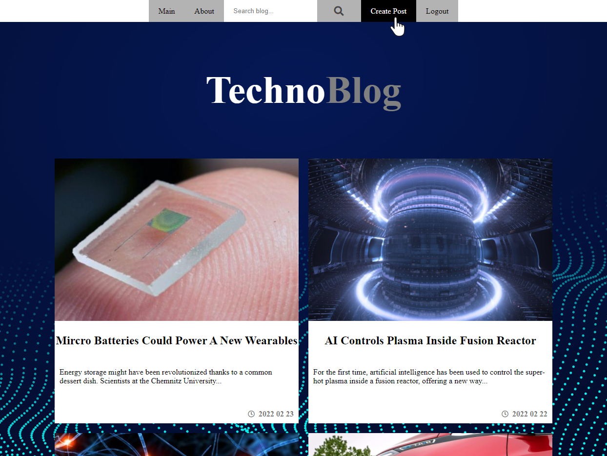

# Techno Blog

 
     

## About project
The project was created using Laravel Framework 8.77.1. 
 Website in which only admin can create blogs and post them. Blogs contain Image, link, title, 
 a short description, and text content. Blog create and login forms have js validation for 
 empty field. Also there is search for blogs. 
 Login page http://www.blogabouttechnology.info/login have protection from creating and 
 posting blog post without login. Website has responsive design (pc, tablet, mobile).
 Website created for educational purposes learning and improving front-end.

## Project Setup
Create a project with Laravel 8.77.1
 Instal:
 npm composer pacageses
 php node
 webpack sass loader
 MySQL workbanch
 font-awesome
 ckeditor5

## Created by
Designed and created by Mantas Petrauskas
 more projects https://github.com/mantodinas
 Back-end was helped by https://github.com/zydrunasG
 
 Website published at: http://www.blogabouttechnology.info/

